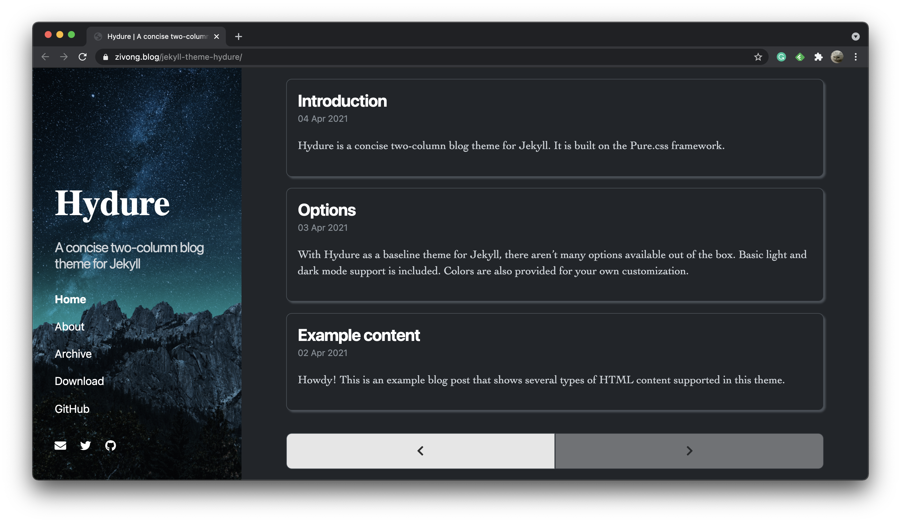

# Hydure <!-- omit in toc -->

Hydure is a concise two-column blog theme for Jekyll. It is built on the [Pure.css](https://github.com/pure-css/pure) framework.

Check out the [demo](https://zivong.blog/jekyll-theme-hydure/).

|       | Mobile | Desktop |
| ----- | ------ | ------- |
| Light |  |  |
| Dark  |  |  |

## Highlight Features <!-- omit in toc -->

- [Open Color](https://github.com/yeun/open-color)
- Dark mode, via [`prefers-color-scheme`](https://developer.mozilla.org/en-US/docs/Web/CSS/@media/prefers-color-scheme)
- [Font Awesome](https://fontawesome.com/)
- [Jekyll Paginate](https://github.com/jekyll/jekyll-paginate)
- [Jekyll Feed](https://github.com/jekyll/jekyll-feed/)
- [Jekyll SEO Tag](https://github.com/jekyll/jekyll-seo-tag/)
- [MathJax](https://www.mathjax.org/)
- [Disqus](https://disqus.com/)
- [Google Analytics 4](https://support.google.com/analytics/answer/10089681?hl=en)
- Archive implemented by pure [Liquid](https://shopify.github.io/liquid/)

## Table of Contents <!-- omit in toc -->

- [Installation](#installation)
- [Usage](#usage)
  - [Global Configuration](#global-configuration)
  - [Post Configuration](#post-configuration)
  - [Homepage](#homepage)
  - [Custom Head](#custom-head)
  - [Navigation](#navigation)
  - [Social Links](#social-links)
  - [Alert Messages](#alert-messages)
  - [Archive](#archive)
- [Contributing](#contributing)
- [Development](#development)
- [License](#license)

## Installation

Add this line to your Jekyll site's `Gemfile`:

```ruby
gem "jekyll-theme-hydure"
```

And add this line to your Jekyll site's `_config.yml`:

```yaml
theme: jekyll-theme-hydure
```

And then execute:

```shell
bundle
```

Or install it yourself as:

```shell
gem install jekyll-theme-hydure
```

If your website is hosted on GitHub Pages, you can install this theme via [`jekyll-remote-theme`](https://github.com/benbalter/jekyll-remote-theme).

Add the following to your `Gemfile`:

```ruby
gem "jekyll-remote-theme"
```

And add this line to your Jekyll site's `_config.yml`:

```yml
plugins:
  - jekyll-remote-theme
```

Add the following to your site's `_config.yml`:

```yml
remote_theme: zivong/jekyll-theme-hydure
```

## Usage

### Global Configuration

| Variable | Type | Default | Specification |
| -------- | ---- | ------- | ------------- |
| `lang` | String | `en` | The language of pages; The value can be overwritten by the `lang` variable on each page. |
| `title` | String | --- | The title of the website |
| `tagline` | String | --- | The tagline of the website |
| `cover` | String | --- | The URL of the sidebar cover image; The value can be overwritten by the `cover` variable on each page. |
| `author.name` | String | --- | The name of the website author |
| `author.url` | String | --- | A URL of the website author |
| `disqus` | String | --- | Disqus short name |
| `google_analytics` | String | --- | Google Analytics 4 Measurement ID |
| `tags_path` | String | --- | A path to the archive-by-tags page; It is used by tags on each post |
| `categories_path` | String | --- | A path to the archive-by-categories page; It is used by categories on each post |

### Post Configuration

| Variable | Type | Default | Specification |
| -------- | ---- | ------- | ------------- |
| `description` | String | --- | A description of the current post |
| `last_modified_at` | String | --- | The date of the last modification you made on a post after its publishing |
| `author` | String or Array | --- | The author name(s) of the post |
| `math` | Boolean | `false` | Does enable MathJax on this page |
| `comments` | Boolean | `true` | Does enable the Disqus comment system |

### Homepage

You can create a homepage for your site by setting `layout: home` in your `index.html`.

### Custom Head

Hydure leaves a placeholder to allow defining custom head. All you need to do is putting data into `_includes/custom-head.html`, and they would be automatically included in `<head>`.

### Navigation

The navigation menu of Hydure is configurable. You just need to specify titles and URLs in the file `_data/navigation.yml`, for example,

```yml
- title: Home
  url: /
- title: About
  url: /about/
- title: Archive
  url: /archive/
```

### Social Links

Hydure allows you to show social links on your website. All you need to do is creating a file `_data/social.yml`, for example,

```yml
- title: Email
  url: mailto:zivong@protonmail.com
  icon: fas fa-envelope
- title: Twitter
  url: https://twitter.com/zivong91
  icon: fab fa-twitter
- title: GitHub
  url: https://github.com/zivong
  icon: fab fa-github
```

### Alert Messages

Hydure provides a predefined class `message` to specify **alert messages**. You may add it to single elements like a `<p>`, or to a parent if there are multiple elements to show.

### Archive

Hydure provides some built-in archive pages. It is implemented in pure Liquid. If you want to archive posts by years, you can create a page and put these code in it:

```yml
---
layout: archive
type: years
---
```

Similarly, if you want to archive posts by categories or tags, you can set the `type` property as `categories` or `tags`.

## Contributing

Bug reports and pull requests are welcome on GitHub at https://github.com/zivong/jekyll-theme-hydure. This project is intended to be a safe, welcoming space for collaboration, and contributors are expected to adhere to the [Contributor Covenant](http://contributor-covenant.org) code of conduct.

## Development

To set up your environment to develop this theme, run `bundle install`.

Your theme is setup just like a normal Jekyll site! To test your theme, run `bundle exec jekyll serve` and open your browser at `http://localhost:4000`. This starts a Jekyll server using your theme. Add pages, documents, data, etc. like normal to test your theme's contents. As you make modifications to your theme and to your content, your site will regenerate and you should see the changes in the browser after a refresh, just like normal.

When your theme is released, only the files in `_layouts`, `_includes`, `_sass` and `assets` tracked with Git will be bundled.
To add a custom directory to your theme-gem, please edit the regexp in `jekyll-theme-hydure.gemspec` accordingly.

## License

The theme is available as open source under the terms of the [MIT License](https://opensource.org/licenses/MIT).
